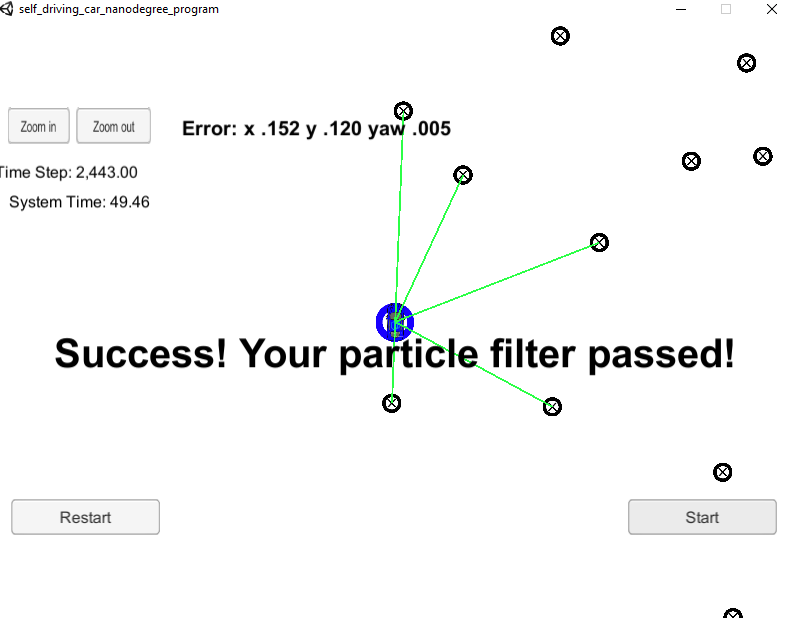

## Project Introduction
Scenario: My robot has been kidnapped and transported to a new location! Luckily it has a map of this location, a (noisy) GPS estimate of its initial location, and lots of (noisy) sensor and control data.

Thus I have implemented a 2 dimensional particle filter (in C++) given by a map and initial localization information. At each time step this filter gets observation and control data. 

## Running the Code
This project involves the Term 2 Simulator which can be downloaded [here](https://github.com/udacity/self-driving-car-sim/releases)

The main program can be built and ran by doing the following from the project top directory.

1. mkdir build && cd build
2. cmake .. && make
3. ./particle_filter

Note that the modified programs to accomplish the project are src/particle_filter.cpp, and particle_filter.h

The program main.cpp does not change from the original version.

INPUT: values provided by the simulator to the c++ program

// sense noisy position data from the simulator

["sense_x"] 

["sense_y"] 

["sense_theta"] 

// get the previous velocity and yaw rate to predict the particle's transitioned state

["previous_velocity"]

["previous_yawrate"]

// receive noisy observation data from the simulator, in a respective list of x/y values

["sense_observations_x"] 

["sense_observations_y"] 


OUTPUT: values provided by the c++ program to the simulator

// best particle values used for calculating the error evaluation

["best_particle_x"]

["best_particle_y"]

["best_particle_theta"] 

My codes have passed the critierai set for the simulator. Please see the scrrenshot with the message:

```
Success! Your particle filter passed!
```



# Implementing the Particle Filter
The directory structure of this repository is as follows:

```
root
|   build.sh
|   clean.sh
|   CMakeLists.txt
|   README.md
|   run.sh
|
|___data
|   |   
|   |   map_data.txt
|   
|   
|___src
    |   helper_functions.h
    |   main.cpp
    |   map.h
    |   particle_filter.cpp
    |   particle_filter.h
```

## Inputs to the Particle Filter
They are located in the `data` directory. 

#### The Map*
`map_data.txt` includes the position of landmarks (in meters) on an arbitrary Cartesian coordinate system. Each row has three columns
1. x position
2. y position
3. landmark id

### All other data the simulator provides, such as observations and controls.

> * Map data provided by 3D Mapping Solutions GmbH.

## Success Criteria

1. **Accuracy**: My particle filter localizes vehicle position and yaw to within the values specified in the parameters `max_translation_error` and `max_yaw_error` in `src/main.cpp`.

2. **Performance**: My particle filter completes execution within the time of 100 seconds.


